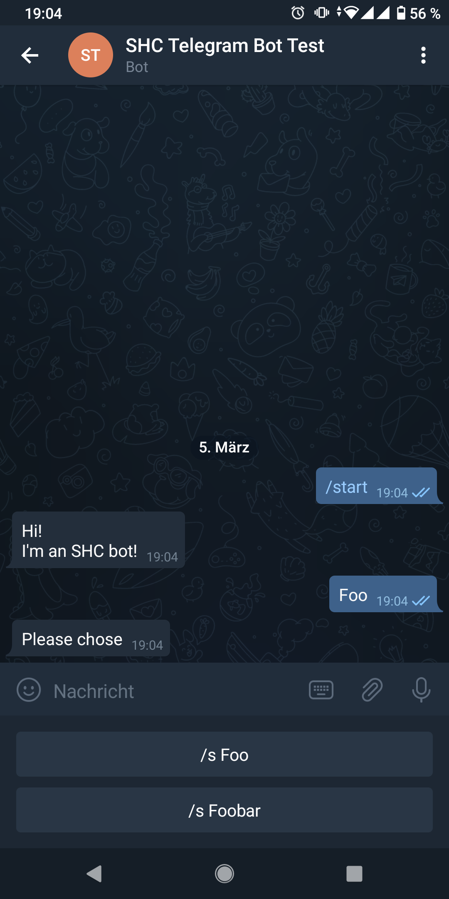
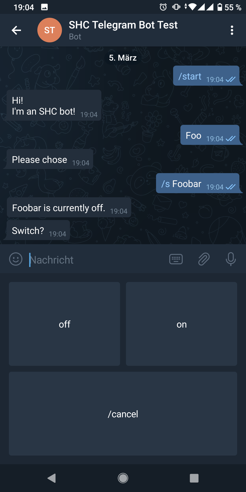
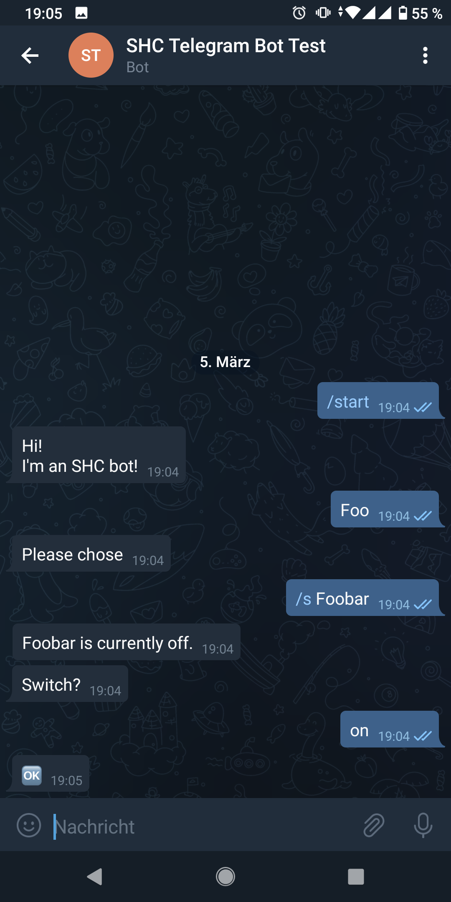

Telegram Bot Interface
======================

.. py:module:: shc.interfaces.telegram

The :mod:`shc.interfaces.telegram` provides an SHC Interface which allows interacting with SHC *connectable* objects via the `Telegram messenger <https://telegram.org/>`_ in form of a chat bot.
Each instance of the :class:`TelegramBot` interface represents one Telegram bot.
It can be used to send messages (:meth:`send_message() <shc.interfaces.telegram.TelegramBot.send_message>`) to specific Telegram users (e.g. from SHC logic handlers) or create named connector objects, allowing authorized users to read and update the values of *connected* SHC objects.

Bot Setup
---------

For creating a Bot interface, first register a Telegram bot, using the "BotFather", as described in `Telegram's documentation <https://core.telegram.org/bots#creating-a-new-bot>`_.
In the process, you will receive an API token for the Telegram Bot API, something like ``110201543:AAHdqTcvCH1vGWJxfSeofSAs0K5PALDsaw``.

In your SHC project, create a Telegram Bot instance and a Telegram authentication/authorization provider.
Currently, SHC only includes the :class:`SimpleTelegramAuth` authentication provider, which uses a fixed dict of usernames with Telegram user/chat ids to authenticate users.
(You can subclass the :class:`TelegramAuthProvider` class to integrate a custom authentication source.)

::

    from shc.interface.telegram import SimpleTelegramAuth, TelegramBot

    telegram_auth = SimpleTelegramAuth({
        'alice': 12345678,     # replace with custom username and your Telegram user id
    })
    telegram_bot = TelegramBot("110201543:AAHdqTcvCH1vGWJxfSeofSAs0K5PALDsaw", telegram_auth)  # insert your API token

If you don't know your Telegram user id yet, leave the SimpleTelegramAuth's user dict empty.
When starting a chat with the bot (see next paragraph), it will tell you your user id.

Afterwards, each user must start a chat with the bot manually.
Otherwise, Telegram will prevent the bot from sending messages to the user.
Simply open a chat with the bot and send a text message ``/start``.
If you're not authorized yet, the bot will tell you so and also tell you your Telegram user id, which can be added to the Telegram authentication provider of your SHC project.

Connector interaction
---------------------

To create *connectable* Connector objects, use one of the following methods:

* :meth:`generic_connector() <TelegramBot.generic_connector>`
* :meth:`str_connector() <TelegramBot.str_connector>`
* :meth:`on_off_connector() <TelegramBot.on_off_connector>`
* :meth:`trigger_connector() <TelegramBot.trigger_connector>`

Each of them takes a name for the connector, along with sets of users for authorization and (partially)
Users are able to search for and select connectors by their name to read and write the value of a connected object:

ng to select "/s Foo" and "/s Foobar".
le to change it ("Switch?") with a custom keyboard with the buttons "on", "off" and "/cancel".

When sending some word to the bot, it will present all matching (and authorized) connector objects to select from.
After selecting a connected (from the list or manually with the ``/s`` command), the current value (if any) is shown and its possible to send a new value; supported by a list of predefined options (depending on the connector type and configuration).
With the ``/cancel`` command (and inline "Cancel" buttons), it's possible to de-select the selected connector to do a new search.

Module docs
-----------

.. autoclass:: TelegramBot

    .. automethod:: generic_connector
    .. automethod:: str_connector
    .. automethod:: on_off_connector
    .. automethod:: trigger_connector

.. autoclass:: TelegramAuthProvider

.. autoclass:: SimpleTelegramAuth
